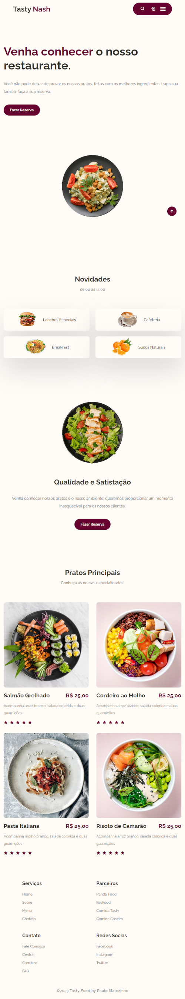

# Tasty Nash
Criação de uma Webpage de um restaurante.

## Sobre o Projeto
Projeto de HTML | CSS | JavaScript com finalidades acadêmicas e didáticas.

## Processo de Criação

- HTML5 Semântico
- CSS3
- JavaScript
- Flex Box
- CCS Grid
  

## Imagen do Projeto

---

## Referências
 - [Tahmid Ahmed](https://www.youtube.com/@tahmidahmed-yt)
